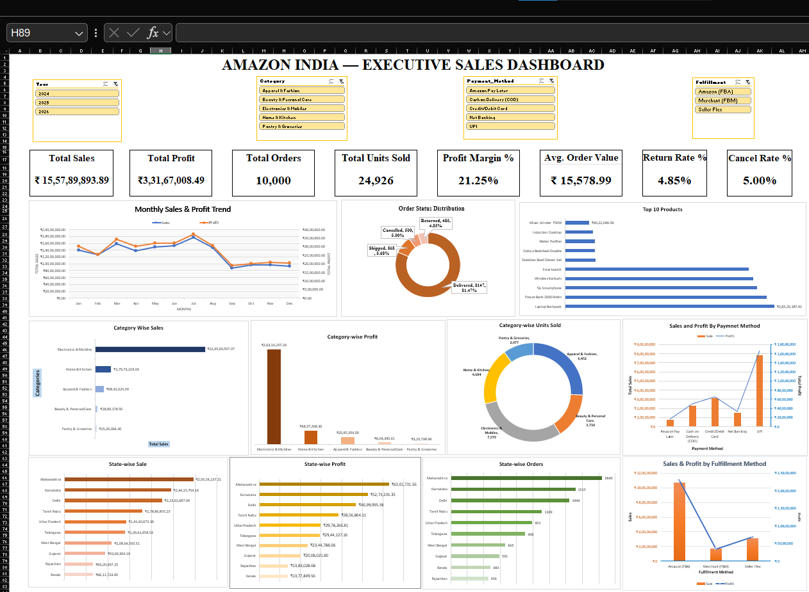
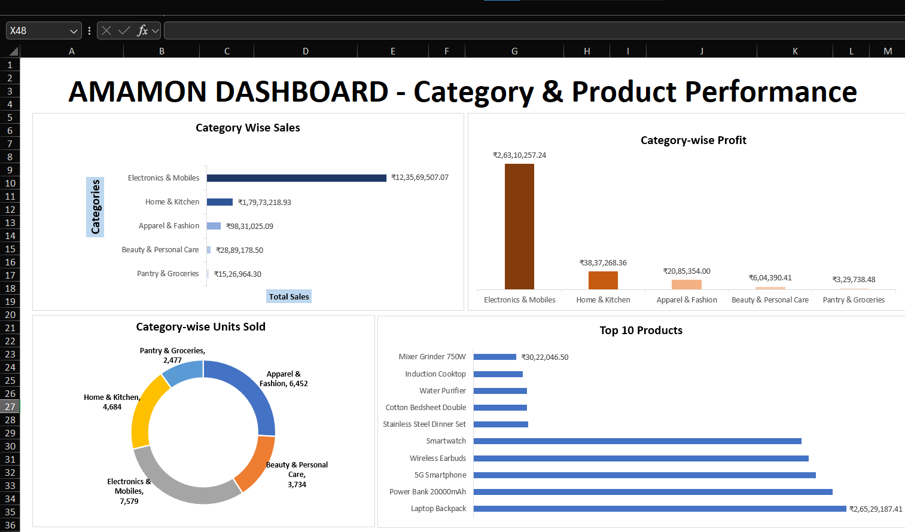
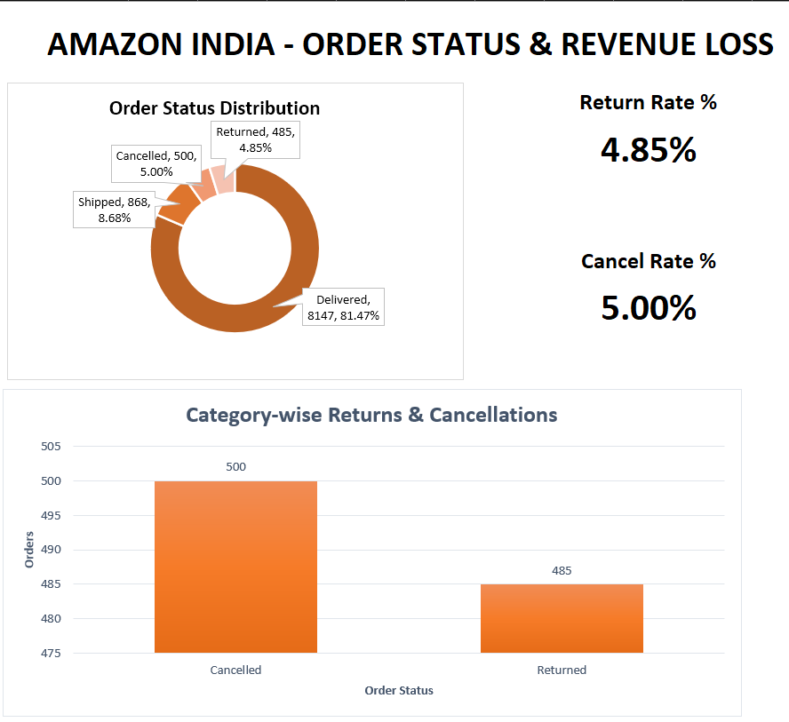
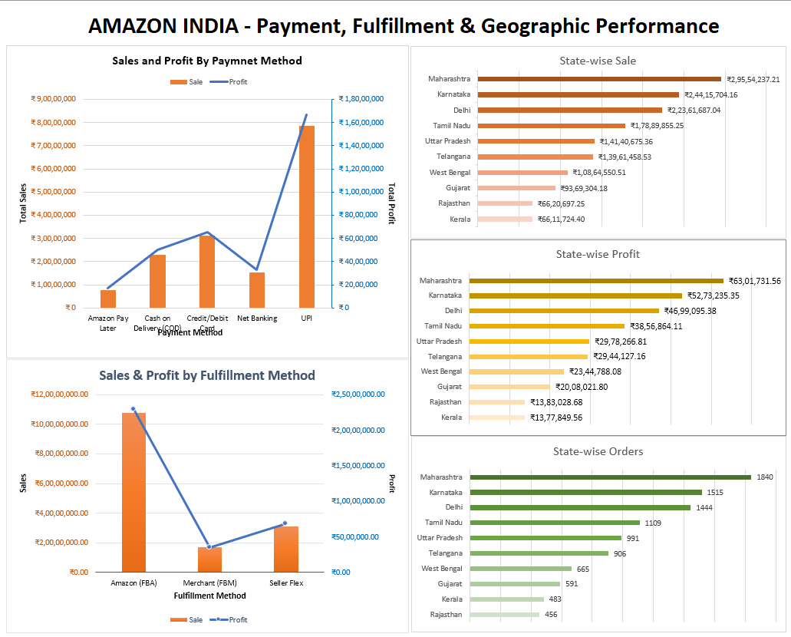
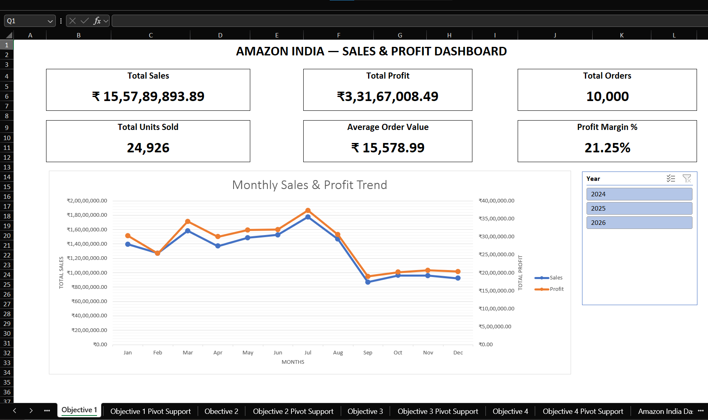

# Amazon India Sales Dashboard

An interactive sales and profitability dashboard built in Microsoft Excel to analyze Amazon India sales performance across products, categories, order statuses, payment methods, fulfillment methods, and geographic regions.

## 📊 Project Overview

This project analyzes Amazon India sales data and transforms the raw transactional data into an interactive executive dashboard.

The dashboard is designed to help management quickly understand:

- Overall sales and profitability
- Monthly sales and profit trends
- Category and product performance
- Order fulfillment and status
- Returns and cancellations
- Payment method performance
- Fulfillment method performance
- State-wise sales, profit and order volume

## 🎯 Business Objectives

### 1. Sales & Profit Performance
- Total Sales
- Total Profit
- Total Orders
- Total Units Sold
- Average Order Value
- Profit Margin
- Monthly Sales & Profit Trend

### 2. Category & Product Performance
- Category-wise Sales
- Category-wise Profit
- Category-wise Units Sold
- Top 10 Products

### 3. Order Status & Revenue Loss
- Delivered Orders
- Shipped Orders
- Returned Orders
- Cancelled Orders
- Return Rate
- Cancellation Rate
- Order Status Distribution
- Category-wise Returns & Cancellations

### 4. Payment, Fulfillment & Geographic Performance
- Sales by Payment Method
- Profit by Payment Method
- Sales by Fulfillment Method
- Profit by Fulfillment Method
- State-wise Sales
- State-wise Profit
- State-wise Orders

## 🛠️ Tools & Technologies

- Microsoft Excel
- PivotTables
- PivotCharts
- Excel Slicers
- KPI Cards
- Data Visualization
- Business Analysis

## 📌 Dashboard Features

The executive dashboard includes interactive slicers for:

- Year
- Category
- Payment Method
- Fulfillment Method

These slicers are connected to the underlying PivotTables and PivotCharts, allowing users to dynamically filter the dashboard.

## 📊 Dashboard Screenshots

### Executive Dashboard

### Category & Product Performance

### Order Status & Revenue Loss

### Payment, Fulfillment & Geographic Performance

### Sales & Profit Analysis

## 📁 Repository Structure

amazon-india-sales-dashboard/
│
├── README.md
├── Amazon_Sales_Data_India.xlsx
│
└── screenshots/
    ├── executive_dashboard.png
    ├── category_product_dashboard.png
    ├── order_status_dashboard.png
    ├── payment_fulfillment_dashboard.png
    └── sales_profit_dashboard.png
